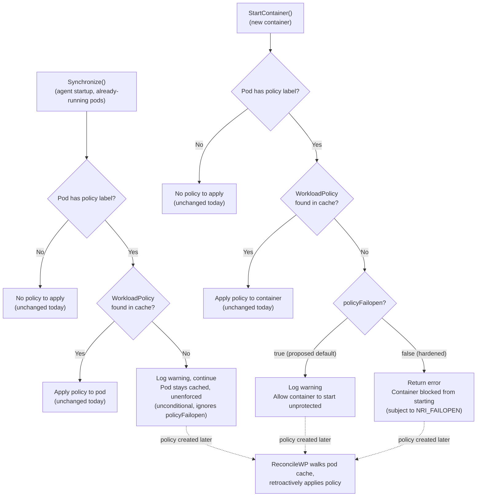

|              |                                                              |
| ------------ | ------------------------------------------------------------ |
| Feature Name | Configurable handling of missing `WorkloadPolicy` references |
| Start Date   | 2026-09-24                                                   |
| Category     | Agent / Reliability / Security                               |
| RFC PR       | https://github.com/kubewarden/runtime-enforcer/pull/930      |
| State        | **ACCEPTED**                                                 |

# Summary

[summary]: #summary

When a pod carries the `runtimeenforcer.kubewarden.io/policy: <name>` label
but the referenced `WorkloadPolicy` doesn't exist (a "dangling reference"),
the agent today always treats it as a hard, blocking error. Depending on
where this happens, this either prevents the whole agent from becoming
`Ready` (crash-looping the DaemonSet pod, see
[#853](https://github.com/kubewarden/runtime-enforcer/issues/853)) or
prevents a single container from starting.

This RFC introduces a unified approach to handle these errors.

runtime-enforcer will never abort agent startup (`Synchronize`) because of a
missing policy anymore, regardless of configuration. Instead, a warning is
printed on error and the agent continues, so a single misconfigured or dangling
reference can never prevent the agent from becoming `Ready` and protecting
the rest of the cluster. The real enforcement decision — whether to let an
unprotected workload start — happens at container-creation time
(`StartContainer`), where it actually matters.

Whether `StartContainer` blocks a new container when its policy is missing
can be customized via a flag:

- **default (non-strict)**: containers are always allowed to start even if
  their policy doesn't exist. A warning is printed.
- **hardened (strict)**: preserves today's `StartContainer` behavior exactly
  — a missing policy is a hard error that blocks the new container from
  starting.

`Synchronize` is unconditionally non-blocking in both modes; the flag only
affects `StartContainer`.

This way, we make it clear that maintaining the label is the user's
responsibility. A misconfigured label only affects that specific workload —
in hardened mode its new containers are blocked, and in the default mode it
runs unprotected with a warning — and never takes down the runtime-enforcer
agent.

# Motivation

[motivation]: #motivation

## Current behavior

Whenever the agent encounters a pod whose `runtimeenforcer.kubewarden.io/policy`
label references a `WorkloadPolicy` that doesn't exist, it treats this as a
hard, blocking error — both when reconciling the state of already-running
pods/containers at agent startup, and when a brand-new container is about to
start.

This is a deliberate, fail-closed design choice: if an operator has
explicitly labeled a workload as requiring a policy, and that policy cannot
be resolved, the agent cannot guarantee the workload is protected. This is
especially useful during upgrades, so protection is guaranteed during and
after the upgrade.

However, this behavior causes problems in two scenarios:

- Dangling labels
- Misconfiguration

### Dangling labels

This is reported in
[#853](https://github.com/kubewarden/runtime-enforcer/issues/853). The flow is:

1. Install runtime-enforcer.
2. Create one or more `WorkloadPolicy` resources and assign them to
   workloads (label applied to the pod template).
3. Uninstall runtime-enforcer. This removes the CRDs (and, as a result, all
   `WorkloadPolicy`/`WorkloadPolicyProposal` custom resources), but **does
   not** remove the `runtimeenforcer.kubewarden.io/policy` label already
   present on running workloads — Kubernetes has no way to know that label
   is now meaningless.
4. Reinstall runtime-enforcer. The agent starts, sees the still-labeled
   pods, but the referenced policies no longer exist anywhere in the
   cluster.
5. Runtime-enforcer fails to start and enters a crash loop.

While it's possible to use a Kubewarden policy to enforce that a workload
cannot be admitted if its referenced policy doesn't exist, it doesn't
prevent this particular scenario from happening, since the label is set
before uninstall and the CRD (and any admission-time enforcement of it) is
gone by the time the agent is reinstalled.

### Misconfiguration

When the kubewarden policy is not enabled, it's possible for a pod, regardless
of whether it can run or not, to reference a policy that doesn't exist.

Say a non-existing policy is assigned to a DaemonSet: when a new node is
added to the cluster, it's possible for that pod to start before the
runtime-enforcer agent, and then be picked up by `Synchronize` when the
agent starts.

## Examples / User Stories

[examples]: #examples

There are two different user stories that conflict somewhat.  That's why a
new config option would make sense:

- As a cluster operator, I want the agent to always reach `Ready` and
  keep protecting the rest of my cluster. At the same time, I want my
  workloads to keep working even if there's a misconfiguration in the
  system, especially in critical systems where any downtime is a serious
  concern.
- As a security-conscious operator in a hardened environment, I want any
  workload that requires a policy to fail to start if its protection isn't
  in place.

# Detailed design

[design]: #detailed-design

## New configuration

A new boolean setting controls the enforcement posture for
`StartContainer` when a `WorkloadPolicy` is missing, named to match the
existing `nriFailopen` / `NRI_FAILOPEN` convention:

- Helm value: `agent.policyFailopen` (proposed default: `true`)
- Environment variable read by the agent: `POLICY_FAILOPEN`
  (`"true"` / `"false"`).

`true` ("fail open") means a missing policy never blocks a new container
from starting; `false` ("fail closed" / hardened) preserves today's
`StartContainer` blocking behavior exactly. This flag has no effect on
`Synchronize`, which never blocks on a missing policy in either mode (see
below). It is exposed in `values.yaml`/`values.schema.json`/chart README
the same way `agent.nriFailopen` is today, and wired into the DaemonSet's
env in `templates/agent/daemonset.yaml`.

## Behavior matrix

| Call site          | `policyFailopen=true` (proposed default)                            | `policyFailopen=false` (hardened)                                                               |
| ------------------ | ------------------------------------------------------------------- | ----------------------------------------------------------------------------------------------- |
| `Synchronize()`    | Log `Warn`, skip enforcement for that pod, sync continues/completes | Flag has no effect — same as the left column (unconditionally non-blocking)                     |
| `StartContainer()` | Log `Warn`, allow the container to start unprotected                | Today's behavior: return error, blocking the container from starting, subject to `NRI_FAILOPEN` |

`Synchronize()` behaves identically regardless of `policyFailopen` — a
missing policy is unconditionally non-blocking there. The flag only changes
`StartContainer()`'s behavior.

In both modes, `AddPodContainerFromNri` continues to record the pod in the
resolver's cache (`r.podCache[podID] = state`) before resolving its policy,
regardless of whether the policy was found. This means that if the missing
`WorkloadPolicy` is later created (or reconciled), the existing
`ReconcileWP` logic — which walks `r.podCache` and matches by
namespace/name — retroactively applies it to the pod. This self-healing
behavior applies regardless of `policyFailopen`.

## Flow

## Code changes

- `internal/resolver`: the missing-policy path becomes configurable via a
  `failOpen` flag threaded through `AddPodContainerFromNri` into
  `applyPolicyToPodIfPresent` — when open, it logs a warning and continues;
  when closed, it returns today's error. This flag is how the two NRI
  callbacks select different behavior.
- `internal/nri`: the plugin reads the new `POLICY_FAILOPEN` env var (with
  a default of `true`). `Synchronize()` always calls the resolver in
  fail-open mode, so a missing policy can never abort startup
  synchronization (this fixes #853). `StartContainer()` uses the configured
  value, and a resulting error still flows through the existing
  `NRI_FAILOPEN` handling.
- Helm chart: add `agent.policyFailopen` to `values.yaml`,
  `values.schema.json`, and the DaemonSet env, mirroring how
  `agent.nriFailopen` is wired today. Document it in the chart README,
  making clear it only affects `StartContainer`.

## Observability

A missing policy is always logged with structured fields (`pod.namespace`,
`pod.name`, `pod.policy`) so it's discoverable via logs regardless of
mode. The resolver logs a `Warn` whenever the pod/container is allowed
through (`Synchronize` always, `StartContainer` when `policyFailopen=true`).
When `StartContainer` blocks the container (`policyFailopen=false`), the
returned error is logged as `Error` by the plugin's existing `handleError`,
which already carries pod/container context. Exposing this as a first-class
Kubernetes `Event` or metric is useful future work but out of scope here.

# Drawbacks

[drawbacks]: #drawbacks

- Out-of-box behavior is not the securest one.  Users have to disable the failopen
  flag to ensure pods specified with a non-existing policy can't run. 

# Alternatives

[alternatives]: #alternatives

- **Always non-fatal everywhere, including `StartContainer` (no flag).**
  `NRI_FAILOPEN` already makes `StartContainer` non-fatal, but it does not
  consult that flag in `Synchronize`, so it cannot prevent a missing-policy
  error from aborting synchronization (i.e. it does not fix #853). Even if
  it did, always failing open doesn't address the second user story, where
  a security-aware operator wants to ensure protection is present before a
  container starts.
- **Only fix `Synchronize`, keep `StartContainer` always fail-closed (no
  flag).** While a dangling/misconfigured label would no longer prevent the
  agent from running, any *new* pod created for that workload (e.g. a
  rolling update or scale-up) would still be prevented from running. This
  is undesirable for the first user story.
- **Not removing CRs during helm uninstall.** `helm.sh/resource-policy:
  keep` is a Helm-only feature and doesn't work in all scenarios — e.g.
  with ArgoCD, or when users use `helm template` piped to `kubectl apply`.
- **Remove labels through a post-delete hook.** Helm hooks are a rarely
  used feature and can lead to high complexity.
- **Fallback to monitor mode** unfortunately when the policy specified
  is not present, we don't have a monitor policy to fallback to.  

# Unresolved questions

[unresolved]: #unresolved-questions

- Whether we treat `policyFailopen` true by default. 
